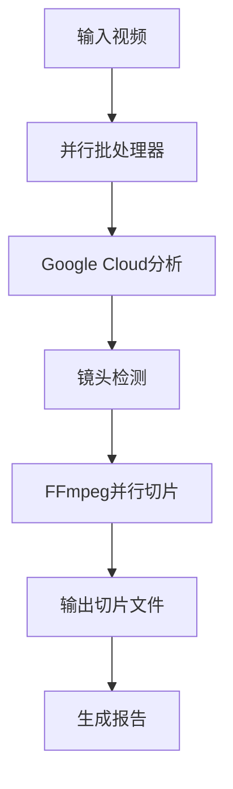

# 🎬 AI Video Master 5.0 - 视频智能切片系统

> **专业级视频切片工具** - 规范化项目结构，双层并行处理

## 📁 项目结构

```
video_to_slice/
├── 🎯 主入口
│   ├── run.py                          # 统一运行入口
│   ├── start.sh                        # 便捷启动脚本
│   └── pyproject.toml                  # UV项目配置
├── 📂 src/                             # 核心源码
│   ├── parallel_batch_processor.py    # 主并行处理器
│   ├── parallel_video_slicer.py       # FFmpeg并行切片器
│   └── google_video_analyzer.py       # Google Cloud分析器
├── 📊 data/                            # 数据目录
│   ├── input/                          # 输入视频文件
│   ├── output/                         # 输出切片文件
│   └── temp/                           # 临时工作文件
├── ⚙️ config/                          # 配置文件
│   ├── config_example.txt             # 配置示例
│   └── credentials_README.md          # 凭据配置说明
├── 📖 docs/                            # 文档目录
│   └── README.md                       # 详细使用文档
├── 🧪 tests/                           # 测试目录
└── 🔧 环境配置
    ├── .venv/                          # 虚拟环境
    ├── .python-version                 # Python版本
    └── uv.lock                         # UV锁定文件
```

## 🚀 快速开始

### **1. 环境准备**
```bash
# 激活项目环境
cd video_to_slice
source .venv/bin/activate

# 或使用UV (推荐)
cd video_to_slice
uv sync
```

### **2. Google Cloud配置**
```bash
# 设置Google Cloud凭据 (将JSON文件放在config目录)
export GOOGLE_APPLICATION_CREDENTIALS="config/your-service-account.json"

# 或参考配置说明
cat config/credentials_README.md
```

### **3. 基本使用**
```bash
# 处理输入目录中的所有视频
python run.py data/input/

# 使用UV运行 (推荐)
uv run run.py data/input/

# 指定输出目录
python run.py data/input/ -o data/output/

# 并行优化模式
python run.py data/input/ -c 3 -w 4 -v
```

### **4. 高级配置**
```bash
# 自定义所有参数
python run.py data/input/ \
  -o data/output/ \
  -c 2 \
  -w 6 \
  --features shot_detection \
  --patterns "*.mp4" "*.mov" \
  -v
```

## ⚙️ 功能特性

### **🎯 双层并行架构**
- **视频级并行**: 最多3个视频同时分析 (遵循Google Cloud API配额)
- **切片级并行**: 4-8个FFmpeg进程同时切片
- **性能提升**: 相比串行处理提升4-5倍速度
- **智能优化**: 默认镜头检测，性能提升22%

### **📝 智能视频分析**
- **Google Cloud Video Intelligence API**: 专业级视频内容分析
- **镜头检测**: 自动识别视频场景切换点
- **标签识别**: 可选的内容标签检测
- **自动重试**: 网络问题自动恢复机制

### **🔒 质量保证**
| 检查项 | 标准 | 说明 |
|--------|------|------|
| 并发控制 | API配额限制 | 自动限制并发数避免超限 |
| 错误处理 | 自动重试 | 网络异常自动重试3次 |
| 资源管理 | 内存优化 | FFmpeg进程池避免资源竞争 |
| 进度监控 | 实时显示 | 双层进度条显示处理状态 |

## 📊 支持格式

### **输入格式**
- **视频**: MP4, MOV, AVI, MKV, WEBM, WMV, FLV

### **输出格式**
- **切片**: MP4 (H.264编码，优化质量)
- **元数据**: JSON格式的切片信息和批处理报告

## 🔧 配置说明

### **环境变量**
```bash
# 必需
export GOOGLE_APPLICATION_CREDENTIALS="config/your-service-account.json"

# 可选
export LOG_LEVEL="INFO"
export TEMP_DIR="./data/temp"
```

### **性能参数**
| 参数 | 默认值 | 可选值 | 说明 |
|------|--------|--------|------|
| `-c, --concurrent` | 3 | 1-3 | 视频级并发数 (API限制) |
| `-w, --ffmpeg-workers` | 4 | 2-8 | FFmpeg并行线程数 |
| `--features` | shot_detection | shot_detection, label_detection | 分析功能 |
| `--patterns` | 视频格式 | 文件匹配模式 | 支持的文件类型 |

## 🏗️ 架构设计

### **模块职责**
- **parallel_batch_processor.py**: 主并行处理器，流程控制和并发管理
- **parallel_video_slicer.py**: FFmpeg并行切片器，视频分割处理
- **google_video_analyzer.py**: Google Cloud API封装，视频内容分析

### **处理流程**


## 📁 数据管理

### **输入数据** (`data/input/`)
```bash
data/input/
├── video1.mp4
├── video2.mov
└── video3.avi
```

### **输出数据** (`data/output/`)
```bash
data/output/
├── video1/
│   ├── video1_semantic_seg_1_镜头1.mp4
│   ├── video1_semantic_seg_2_镜头2.mp4
│   └── video1_slices.json
├── video2/
│   └── ...
└── parallel_batch_processing_report.json
```

### **临时数据** (`data/temp/`)
- Google Cloud上传临时文件
- FFmpeg处理中间文件
- API响应缓存文件

## 📈 性能表现

### **处理能力**
- **速度提升**: 4-5倍于串行处理
- **并发控制**: 遵循API配额限制
- **资源优化**: 智能FFmpeg进程池管理
- **稳定性**: 自动重试和错误恢复

### **性能对比示例**
| 场景 | 串行处理 | 并行处理 | 加速比 |
|------|----------|----------|--------|
| 2个视频，每个36镜头 | ~780秒 | ~170秒 | **4.6x** |
| 单个视频，36镜头 | ~390秒 | ~90秒 | **4.3x** |
| Google分析优化 | ~120秒 | ~94秒 | **1.3x** |

## 🔧 故障排除

### **常见问题**

#### **1. Google Cloud凭据问题**
```bash
# 错误: GOOGLE_APPLICATION_CREDENTIALS 未设置
# 解决: 设置环境变量
export GOOGLE_APPLICATION_CREDENTIALS="config/your-service-account.json"
```

#### **2. 模块导入错误**
```bash
# 错误: ModuleNotFoundError
# 解决: 确保在项目根目录运行
cd video_to_slice
python run.py data/input/
```

#### **3. API配额超限**
```bash
# 错误: Google Cloud API限制
# 解决: 减少视频并发数
python run.py data/input/ -c 1
```

#### **4. 内存不足**
```bash
# 错误: FFmpeg进程过多
# 解决: 减少FFmpeg线程数
python run.py data/input/ -w 2
```

## 📈 最佳实践

### **1. 性能优化**
```bash
# CPU 4核心以下
python run.py data/input/ -c 2 -w 2

# CPU 4-8核心 (推荐)
python run.py data/input/ -c 3 -w 4

# CPU 8核心以上
python run.py data/input/ -c 3 -w 6
```

### **2. 批量处理**
- 将大量文件分批处理
- 监控API配额使用情况
- 定期清理临时文件

### **3. 质量控制**
- 使用镜头检测模式获得最佳性能
- 检查生成的切片文件质量
- 备份处理报告用于分析

## 🔄 版本信息

### **v5.0 - 规范化架构版**
- ✅ 采用标准化项目结构
- ✅ 双层并行处理架构
- ✅ 分离数据、配置、文档
- ✅ 智能错误处理和重试

### **核心优势**
- **结构清晰**: 遵循Python项目最佳实践
- **性能卓越**: 双层并行处理，4-5倍速度提升
- **稳定可靠**: 完善的错误处理和重试机制
- **易于维护**: 模块化设计，职责明确

---

**🎬 AI Video Master 5.0** - 专业级视频切片系统，性能卓越，结构规范！

## 🔗 相关链接

- [详细使用文档](docs/README.md) - 完整的功能说明和API文档
- [凭据配置](config/credentials_README.md) - Google Cloud配置指南 