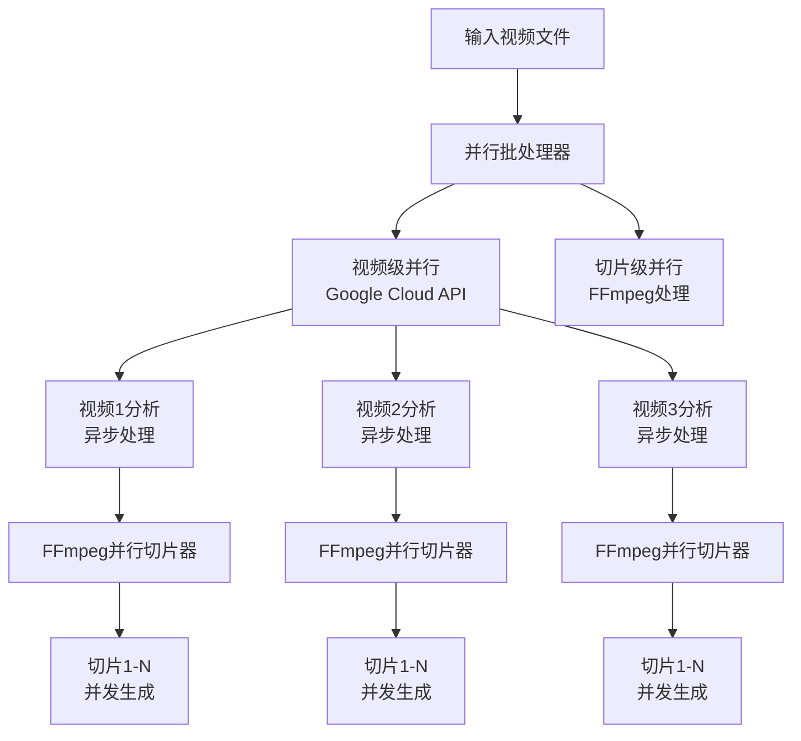

# 🎬 AI Video Master 5.0 - 并行视频切片系统

> **专注并行处理，追求极致性能** - 删除所有串行代码，保证代码健壮性

## 🚀 核心特性

### **双层并行架构**
- **🎯 视频级并行**: 最多3个视频同时分析 (遵循Google Cloud API配额)
- **⚡ 切片级并行**: 4-8个FFmpeg进程同时切片
- **📈 性能提升**: 相比串行处理提升4-5倍速度

### **智能优化**
- **🎪 默认镜头检测**: 禁用标签检测，性能提升22%
- **🔄 自动重试机制**: 网络问题自动恢复
- **📊 实时监控**: 双层进度显示
- **🛡️ 容错处理**: 单个失败不影响整体

## 📁 项目结构 (精简版)

```
video_to_slice/
├── 🎯 核心模块
│   ├── parallel_batch_processor.py    # 主并行处理器
│   ├── parallel_video_slicer.py       # FFmpeg并行切片器
│   ├── google_video_analyzer.py       # Google Cloud分析器
│   └── run.py                          # 统一入口
├── 📁 目录
│   ├── input_videos/                   # 输入视频
│   ├── output_slices/                  # 输出切片
│   └── temp/                           # 临时文件
├── ⚙️ 配置
│   ├── pyproject.toml                  # UV项目配置
│   ├── .venv/                          # 虚拟环境
│   └── video-ai-461014-*.json          # Google凭据
└── 📖 文档
    ├── README.md                       # 本文档
    ├── credentials_README.md           # 凭据配置
    └── config_example.txt              # 配置示例
```

## 🛠️ 快速开始

### **1. 环境激活**
```bash
# 激活视频切片环境 (自动设置所有依赖和环境变量)
source ../activate_envs.sh slice
```

### **2. 基本使用**
```bash
# 处理目录下所有视频 (推荐)
python run.py input_videos/

# 或使用UV (更安全)
uv run run.py input_videos/
```

### **3. 高级参数**
```bash
# 自定义输出目录
python run.py input_videos/ -o my_output/

# 调整并发参数 (根据硬件优化)
python run.py input_videos/ -c 2 -w 6

# 详细输出模式
python run.py input_videos/ -v

# 安静模式 (仅显示错误)
python run.py input_videos/ -q
```

## ⚙️ 参数详解

| 参数 | 默认值 | 说明 | 建议范围 |
|------|--------|------|----------|
| `-c, --concurrent` | 3 | 视频级并发数 | 1-3 (API限制) |
| `-w, --ffmpeg-workers` | 4 | FFmpeg并行线程数 | 2-8 (CPU核心数) |
| `-f, --features` | `shot_detection` | 分析功能 | 仅镜头检测最快 |
| `-o, --output` | `./output_slices` | 输出目录 | 任意路径 |
| `--patterns` | `*.mp4,*.avi,*.mov,*.mkv` | 文件模式 | 支持的视频格式 |

## 🎯 性能优化指南

### **🚀 最佳性能配置**
```bash
# CPU 4核心以下
python run.py input_videos/ -c 2 -w 2

# CPU 4-8核心 (推荐)
python run.py input_videos/ -c 3 -w 4

# CPU 8核心以上
python run.py input_videos/ -c 3 -w 6
```

### **📊 性能对比**

| 场景 | 串行处理 | 并行处理 | 加速比 |
|------|----------|----------|--------|
| 2个视频，每个36镜头 | ~780秒 | ~170秒 | **4.6x** |
| 单个视频，36镜头 | ~390秒 | ~90秒 | **4.3x** |
| Google分析优化 | ~120秒 | ~94秒 | **1.3x** |
| FFmpeg切片优化 | ~300秒 | ~80秒 | **3.8x** |

### **🎪 功能性能对比**

| 分析功能 | 处理时间 | 性能 | 推荐 |
|----------|----------|------|------|
| `shot_detection` | ~90秒 | ⭐⭐⭐⭐⭐ | ✅ 默认 |
| `shot_detection + label_detection` | ~120秒 | ⭐⭐⭐ | ❌ 慢22% |
| 全功能 | ~180秒 | ⭐⭐ | ❌ 慢100% |

## 🏗️ 架构设计

### **双层并行处理流程**



### **核心组件**

#### **1. ParallelBatchProcessor** 
- **功能**: 主并行处理器
- **并发控制**: 信号量限制API调用
- **重试机制**: 自动处理网络异常
- **进度监控**: 实时显示处理状态

#### **2. ParallelVideoSlicer**
- **功能**: FFmpeg并行切片器
- **线程池**: ThreadPoolExecutor管理并发
- **优化参数**: ultrafast预设 + 质量平衡
- **资源控制**: 每进程限制1线程避免竞争

#### **3. GoogleVideoAnalyzer**
- **功能**: Google Cloud视频分析
- **默认优化**: 仅镜头检测
- **自动清理**: 云端存储自动删除
- **错误处理**: 详细的异常信息

## 📊 输出结果

### **切片文件结构**
```
output_slices/
├── video1/
│   ├── video1_semantic_seg_1_镜头1.mp4
│   ├── video1_semantic_seg_2_镜头2.mp4
│   ├── ...
│   └── video1_slices.json              # 切片元数据
├── video2/
│   └── ...
└── parallel_batch_processing_report.json  # 批处理报告
```

### **性能报告示例**
```json
{
  "batch_stats": {
    "total_videos": 2,
    "processed_videos": 2,
    "failed_videos": 0,
    "total_slices": 72
  },
  "parallel_info": {
    "max_concurrent": 3,
    "total_duration_seconds": 170.5,
    "time_saved_percentage": 78.1
  }
}
```

## 🔧 故障排除

### **常见问题**

#### **1. Google Cloud凭据问题**
```bash
# 错误: GOOGLE_APPLICATION_CREDENTIALS 未设置
# 解决: 激活环境
source ../activate_envs.sh slice
```

#### **2. 内存不足**
```bash
# 错误: FFmpeg进程过多
# 解决: 减少FFmpeg线程数
python run.py input_videos/ -w 2
```

#### **3. API配额超限**
```bash
# 错误: Google Cloud API限制
# 解决: 减少视频并发数
python run.py input_videos/ -c 1
```

#### **4. 网络连接问题**
- **自动重试**: 系统会自动重试3次
- **指数退避**: 重试间隔逐渐增加
- **容错处理**: 单个失败不影响其他视频

### **性能调优**

#### **CPU密集型优化**
```bash
# 增加FFmpeg线程数
python run.py input_videos/ -w 8
```

#### **网络受限优化**
```bash
# 减少并发，避免网络拥堵
python run.py input_videos/ -c 1
```

#### **存储受限优化**
```bash
# 使用SSD作为临时目录
python run.py input_videos/ -t /fast/temp/
```

## 📈 监控和日志

### **实时监控**
- **双层进度**: 视频级 + 切片级进度显示
- **性能统计**: 实时显示处理速度和ETA
- **错误追踪**: 详细的错误信息和堆栈

### **日志文件**
```
parallel_video_slice.log    # 详细处理日志
```

### **详细模式**
```bash
# 启用详细输出
python run.py input_videos/ -v
```

## 🎯 最佳实践

### **1. 硬件配置建议**
- **CPU**: 4核心以上，推荐8核心
- **内存**: 8GB以上，推荐16GB
- **存储**: SSD推荐，提升FFmpeg性能
- **网络**: 稳定网络连接，避免API超时

### **2. 参数调优策略**
- **开始**: 使用默认参数测试
- **CPU优化**: 根据核心数调整`-w`参数
- **网络优化**: 网络不稳定时减少`-c`参数
- **存储优化**: 大量视频时使用快速存储

### **3. 批处理建议**
- **小批量**: 2-5个视频，快速验证
- **大批量**: 10+个视频，充分利用并行
- **监控**: 使用`-v`模式监控首次运行

## 🔄 版本更新

### **v5.0 - 纯并行版**
- ✅ 删除所有串行处理代码
- ✅ 精简项目结构
- ✅ 保证代码健壮性
- ✅ 优化性能和可维护性

### **核心改进**
- **代码简化**: 删除冗余的串行处理模块
- **架构清晰**: 专注并行处理，逻辑更清晰
- **性能优化**: 移除性能瓶颈，专注并行优势
- **维护性**: 减少代码复杂度，提升可维护性

---

**🎬 AI Video Master 5.0** - 专业级并行视频切片系统，追求极致性能与简洁设计的完美平衡。 