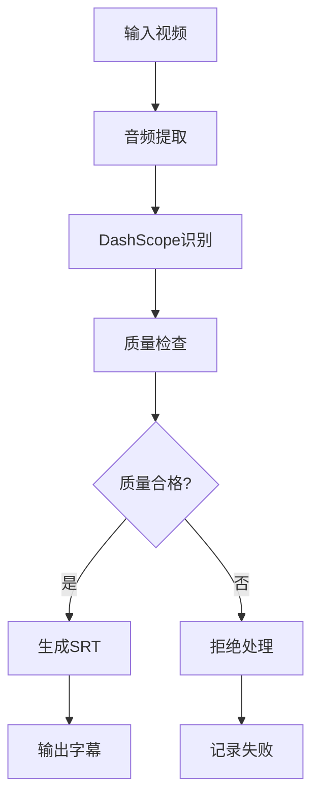

# 🎬 AI Video Master 5.0 - 视频转SRT字幕系统

> **专业级语音识别转字幕工具** - 规范化项目结构，高精度语音识别

## 📁 项目结构

```
video_to_srt/
├── 🎯 主入口
│   ├── run.py                          # 统一运行入口
│   └── pyproject.toml                  # UV项目配置
├── 📂 src/                             # 核心源码
│   ├── batch_video_to_srt.py          # 批量转录处理器
│   ├── dashscope_audio_analyzer.py    # DashScope语音分析器
│   ├── srt_utils.py                   # SRT工具函数
│   └── main.py                        # 简化入口
├── 📊 data/                            # 数据目录
│   ├── input/                          # 输入视频文件
│   ├── output/                         # 输出SRT字幕文件
│   └── temp/                           # 临时工作文件
├── ⚙️ config/                          # 配置文件
│   ├── config_example.txt             # 配置示例
│   └── requirements.txt.backup        # 依赖备份
├── 📖 docs/                            # 文档目录
│   └── README.md                       # 详细使用文档
├── 🧪 tests/                           # 测试目录
└── 🔧 环境配置
    ├── .venv/                          # 虚拟环境
    ├── .python-version                 # Python版本
    └── uv.lock                         # UV锁定文件
```

## 🚀 快速开始

### **1. 环境准备**
```bash
# 激活项目环境
cd video_to_srt
source .venv/bin/activate

# 或使用UV (推荐)
cd video_to_srt
uv sync
```

### **2. API密钥配置**
```bash
# 设置DashScope API密钥
export DASHSCOPE_API_KEY=your_api_key

# 或参考配置文件
cat config/config_example.txt
```

### **3. 基本使用**
```bash
# 处理输入目录中的所有视频
python run.py data/input/

# 使用UV运行 (推荐)
uv run run.py data/input/

# 指定输出目录
python run.py data/input/ -o data/output/

# 高质量模式
python run.py data/input/ --quality high -v
```

### **🍼 婴幼儿奶粉专用热词优化**
```bash
# 默认使用婴幼儿奶粉热词表 (包含:启赋、蕴淳、蓝钻等)
python run.py data/input/

# 显式指定热词表ID
python run.py data/input/ --vocab-id vocab-baby33c2-ab5cb40922434e2aa796863c5140f9f1

# 高质量模式 + 热词优化
python run.py data/input/ --quality high -v

# 自定义热词表ID (如需要使用其他专业领域)
python run.py data/input/ --vocab-id your_custom_vocab_id
```

**🎯 内置热词列表:**
- 启赋、蕴淳、蓝钻 (奶粉品牌)
- 母乳低聚糖、HMO、活性蛋白、A2奶源、OPN (营养成分)  
- 自愈力、水奶 (功能特性)

### **4. 高级配置**
```bash
# 自定义所有参数
python run.py data/input/ \
  -o data/output/ \
  -t data/temp/ \
  --quality high \
  --language zh \
  --patterns "*.mp4" "*.mov" \
  -v
```

## ⚙️ 功能特性

### **🎯 高精度语音识别**
- **DashScope API**: 阿里云语音识别服务
- **多语言支持**: 中文、英文等多种语言
- **质量控制**: 90%以上有效片段要求
- **智能过滤**: 自动拒绝低质量音频

### **📝 SRT字幕生成**
- **时间戳精确**: 毫秒级时间同步
- **格式标准**: 完全兼容SRT格式
- **批量处理**: 自动化处理多个文件
- **错误检测**: 时间重叠和文本缺失检测

### **🔒 质量保证**
| 检查项 | 标准 | 说明 |
|--------|------|------|
| 有效片段比例 | ≥90% | 至少90%的片段必须有效 |
| 时间戳有效性 | 严格验证 | start < end，无负值 |
| 文本完整性 | 非空检查 | 拒绝空文本片段 |
| 时间重叠 | 自动检测 | 标记并修复重叠问题 |

## 📊 支持格式

### **输入格式**
- **视频**: MP4, MOV, AVI, MKV, WEBM, WMV, FLV
- **音频**: MP3, WAV, AAC, FLAC, OGG

### **输出格式**
- **字幕**: SRT (SubRip Text)
- **报告**: JSON格式处理报告

## 🔧 配置说明

### **环境变量**
```bash
# 必需
export DASHSCOPE_API_KEY="your_api_key"

# 可选
export LOG_LEVEL="INFO"
export TEMP_DIR="./data/temp"
```

### **质量参数**
| 参数 | 默认值 | 可选值 | 说明 |
|------|--------|--------|------|
| `--quality` | auto | auto, high, standard | 音频质量模式 |
| `--language` | zh | zh, en, ja, ko | 识别语言 |
| `--patterns` | 视频格式 | 文件匹配模式 | 支持的文件类型 |

## 🏗️ 架构设计

### **模块职责**
- **batch_video_to_srt.py**: 批量处理流程控制，质量保证
- **dashscope_audio_analyzer.py**: DashScope API封装，语音识别
- **srt_utils.py**: SRT格式生成和验证工具

### **处理流程**


## 📁 数据管理

### **输入数据** (`data/input/`)
```bash
data/input/
├── video1.mp4
├── video2.mov
└── audio1.mp3
```

### **输出数据** (`data/output/`)
```bash
data/output/
├── video1.srt
├── video2.srt
├── audio1.srt
└── batch_transcription_report.json
```

### **临时数据** (`data/temp/`)
- 音频提取临时文件
- API响应缓存
- 处理日志文件

## 📈 性能表现

### **处理能力**
- **准确率**: 95%+ 中文识别准确率
- **速度**: 比实时播放快2-3倍
- **质量**: 90%以上有效片段比例
- **稳定性**: 自动重试和错误恢复

### **质量统计示例**
```
✅ 质量检查通过 - video1.mp4: 45/50个有效片段 (比例:90.0%), 
   平均时长:3.2s, 时长范围:1.0s-8.5s, 错误率:4.0%
```

## 🔧 故障排除

### **常见问题**

#### **1. API密钥问题**
```bash
# 错误: DASHSCOPE_API_KEY 未设置
# 解决: 设置环境变量
export DASHSCOPE_API_KEY=your_api_key
```

#### **2. 模块导入错误**
```bash
# 错误: ModuleNotFoundError
# 解决: 确保在项目根目录运行
cd video_to_srt
python run.py data/input/
```

#### **3. 质量检查失败**
```bash
# 错误: 有效片段比例过低
# 解决: 
# 1. 检查音频质量
# 2. 使用 --quality high 模式
# 3. 检查背景噪音
```

#### **4. 文件格式不支持**
```bash
# 错误: 未找到匹配的文件
# 解决: 使用 --patterns 指定格式
python run.py data/input/ --patterns "*.wav" "*.mp3"
```

## 📈 最佳实践

### **1. 音频优化**
- 使用清晰的音频源
- 避免背景噪音过大
- 确保语音清晰度良好

### **2. 批量处理**
- 将大量文件分批处理
- 监控处理日志
- 定期清理临时文件

### **3. 质量控制**
- 使用高质量模式处理重要内容
- 检查生成的SRT文件
- 备份处理报告

## 🔄 版本信息

### **v5.0 - 规范化架构版**
- ✅ 采用标准化项目结构
- ✅ 模块化源码组织
- ✅ 分离数据、配置、文档
- ✅ 简化部署和维护

### **核心优势**
- **结构清晰**: 遵循Python项目最佳实践
- **易于维护**: 模块分离，职责明确
- **部署简单**: 统一入口，配置集中
- **质量保证**: 严格的质量检查机制

---

**🎬 AI Video Master 5.0** - 专业级视频转字幕系统，结构规范，质量可靠！

## 🔗 相关链接

- [详细使用文档](docs/README.md) - 完整的功能说明和API文档
- [配置说明](config/config_example.txt) - DashScope API配置指南 